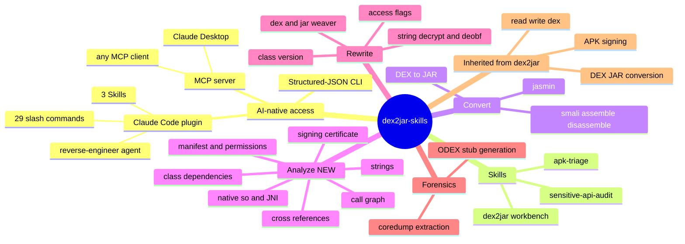

# dex2jar-skills

**English** | [简体中文](README.zh-CN.md)

> **AI-native Android reverse-engineering workbench.** Hand an `.apk`, `.dex`, `.odex`,
> `.jar`, or smali to your AI agent and ask in plain language — "what does this app do?",
> "is it malicious?", "where's the crypto?", "convert this to JAR" — and it drives the
> full dex2jar toolchain for you.

This is a **fork of [dex2jar](https://github.com/pxb1988/dex2jar)** (by pxb1988 and
contributors) that turns the classic toolchain into something an AI agent can use natively.
On top of the original DEX/JAR/smali engine we added a structured-JSON CLI, a fleet of new
analysis commands, an [MCP](https://modelcontextprotocol.io) server, and a full
[Claude Code](https://claude.com/claude-code) plugin (Skills + slash commands + an agent).

---

## 🌳 Feature tree



---

## 🤖 AI Agent access (start here)

This project is **AI-native**: the primary way to use it is to let an agent call it. Three
entry points, one shared engine — pick whichever your client supports.

### 1. Claude Code plugin — Skills + slash commands + agent

```bash
claude plugin add https://github.com/android-security-engineer/dex2jar-skills.git
```

Then just talk to Claude Code. It auto-routes to the right **Skill** by reading each
skill's description — no command memorization needed:

| Skill | Triggers on | What it does |
|-------|-------------|--------------|
| **`dex2jar`** | "reverse this apk", "decompile", "convert dex to jar", 逆向/反编译 | Primary workbench — convert, disassemble, sign, and analyze structure / strings / call graphs / manifests / certs / native code |
| **`apk-triage`** | "is this apk safe?", "what permissions?", 这个apk安全吗 | Fast first-pass triage: identity, attack surface, signer, native footprint, risk read |
| **`sensitive-api-audit`** | "where's the crypto?", "does it load code at runtime?", 找加密的地方 | Hunt sensitive APIs (crypto / reflection / dynamic-load / network) and trace callers to entry points |

You can also call any command directly, e.g. `/dex2jar app.apk` or `/manifest-inspect app.apk`,
and drive the **`reverse-engineer`** agent for end-to-end workflows.

### 2. MCP server — Claude Desktop & any MCP client

```bash
pip install mcp
python3 dex2jar-mcp/server.py
```

Register it with your MCP client (Claude Desktop example):

```json
{
  "mcpServers": {
    "dex2jar": {
      "command": "python3",
      "args": ["/path/to/dex2jar-skills/dex2jar-mcp/server.py"]
    }
  }
}
```

All tools are exposed over MCP with resources and prompts. See
[dex2jar-mcp/README.md](dex2jar-mcp/README.md) for client setup.

### 3. Structured-JSON CLI — for your own agents/scripts

Every command returns predictable JSON, so any LLM or script can parse results reliably:

```bash
python3 d2j-ai.py dex2jar app.apk            # convert APK/DEX → JAR
python3 d2j-ai.py manifest-inspect app.apk   # parse AndroidManifest (perms, components)
python3 d2j-ai.py dex-xref --preset crypto app.apk   # find crypto API call sites
python3 d2j-ai.py --pretty list              # list all 29 commands
```

```json
{
  "success": true,
  "error_code": "none",
  "output_path": "app-dex2jar.jar",
  "duration_ms": 1234,
  "timestamp": "2026-06-22T10:30:00+0800",
  "command": "/path/to/d2j-dex2jar.sh app.apk"
}
```

Error codes: `none`, `file_not_found`, `invalid_format`, `command_failed`, `unknown_command`.

---

## ✨ What this fork adds on top of dex2jar

The upstream project gives you the DEX/JAR/smali conversion engine. This fork layers an
**AI-native surface** on top:

- **`d2j-ai.py`** — a structured-JSON CLI wrapping **29 commands** (no more parsing stderr).
- **New static-analysis commands** (not in upstream): `manifest-inspect`, `apk-cert`,
  `native-libs`, `dex-strings`, `dex-inspect`, `dex-method-trace`, `dex-class-deps`,
  `dex-xref` — manifests, signing certs, native `.so`/JNI, strings, call graphs,
  cross-references, dependency graphs.
- **`dex2jar-ai-cli/`** — the Java implementation behind those new analysis commands.
- **`dex2jar-mcp/`** — an MCP server exposing everything to MCP clients.
- **Claude Code plugin** — `skills/` (3 skills), `commands/` (slash commands),
  `agents/reverse-engineer.md`.
- **`evals/`** — an offline structural validator + trigger fixtures, gated in CI.
- **`docs/`** — [architecture](docs/architecture.md) and [FAQ](docs/FAQ.md).

Everything else (DEX read/write, DEX↔JAR conversion, APK signing, smali) is inherited
from the original dex2jar.

---

## 🧩 Capabilities at a glance

| Group | Commands |
|-------|----------|
| **Convert** | `dex2jar`, `mt-dex2jar`, `jar2dex`, `baksmali`, `dex2smali`, `smali`, `jar2jasmin`, `jasmin2jar`, `dex-asmifier` |
| **Analyze** (new) | `manifest-inspect`, `apk-cert`, `native-libs`, `dex-strings`, `dex-inspect`, `dex-method-trace`, `dex-class-deps`, `dex-xref` |
| **Rewrite / edit** | `jar-access`, `dex-weaver`, `jar-weaver`, `class-version-switch`, `dex-recompute-checksum` |
| **Deobfuscate** | `decrypt-string`, `init-deobf` |
| **Sign / package** | `apk-sign`, `std-apk` |
| **Verify** | `asm-verify` |
| **ODEX / forensics** | `generate-stub-from-odex`, `extract-odex-from-coredump` |
| **Meta** | `list`, `info`, `batch` |

Run `python3 d2j-ai.py info <command>` for any command's options. Full reference:
[README.skills.md](README.skills.md) and `skills/dex2jar/references/command-reference.md`.

---

## 📦 Installation

### Build the core tools

```bash
./gradlew distZip
cd dex-tools/build/distributions
unzip dex-tools-*.zip          # produces a directory of d2j-*.sh scripts
```

Requires JDK 8+ and Python 3 for the AI CLI. Everything runs **offline**.

---

## ⚙️ Usage beyond the agent

### Batch workflows

Define a sequence of commands in JSON:

```json
[
  {"command": "dex2jar", "args": ["app.apk"]},
  {"command": "asm-verify", "args": ["app-dex2jar.jar"]},
  {"command": "jar2jasmin", "args": ["app-dex2jar.jar"]}
]
```

```bash
python3 d2j-ai.py batch workflow.json
```

### Classic shell scripts (legacy)

```bash
sh d2j-dex2jar.sh -f ~/path/to/app.apk   # output: app-dex2jar.jar
```

---

## 🏗️ Architecture

Entry points are thin wrappers; all logic converges on one JSON CLI:

```
Skills + slash commands + agent   ·   MCP server   ·   structured-JSON CLI   ← entry points
                              ↓             ↓                 ↓
                       d2j-ai.py — 29 commands, unified JSON output          ← orchestration
                                            ↓
              dex2jar-ai-cli (Java, new analysis)  +  dex-tools / dex-* (upstream engine)
```

Details: [docs/architecture.md](docs/architecture.md).

---

## 📚 Docs & community

- [docs/FAQ.md](docs/FAQ.md) — how skills route, offline use, dex→jar accuracy
- [docs/architecture.md](docs/architecture.md) — the four layers
- [ROADMAP.md](ROADMAP.md) — what's planned
- [.github/CONTRIBUTING.md](.github/CONTRIBUTING.md) — contribution guide
- **Issues are open** — bug reports, feature requests, and questions welcome via the
  [issue templates](.github/ISSUE_TEMPLATE).

---

## 📄 License

[Apache License 2.0](http://www.apache.org/licenses/LICENSE-2.0.html). See [LICENSE.txt](LICENSE.txt).

Built on top of [dex2jar](https://github.com/pxb1988/dex2jar) by pxb1988 and contributors.
For authorized security research, CTF, education, and defensive analysis only.
