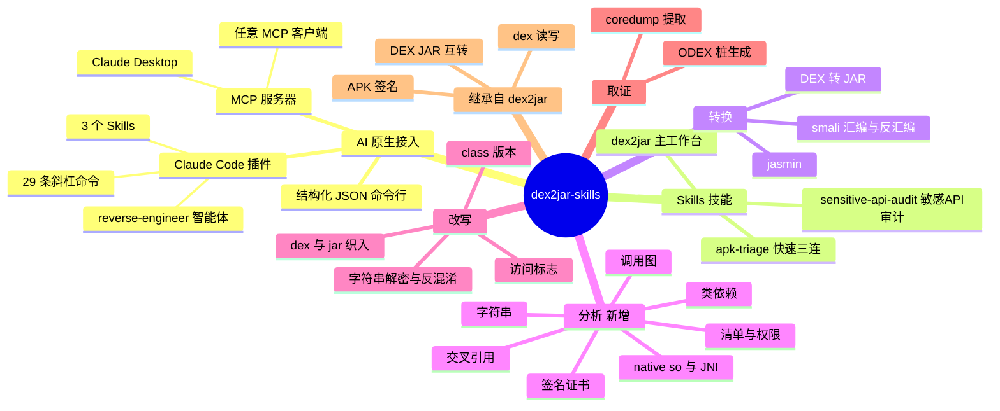

# dex2jar-skills

[English](README.md) | **简体中文**

> **AI 原生的 Android 逆向工程工作台。** 把 `.apk`、`.dex`、`.odex`、`.jar` 或 smali
> 丢给你的 AI 智能体，用大白话提问——"这个 app 干了什么？""有没有恶意行为？"
> "加密在哪？""帮我转成 JAR"——它会自动驱动整套 dex2jar 工具链完成。

本项目是 **[dex2jar](https://github.com/pxb1988/dex2jar)（由 pxb1988 及众多贡献者维护）
的 fork**，在经典工具链之上做了二次开发，把它改造成 AI 智能体可以**原生调用**的形态。
在原有 DEX/JAR/smali 引擎之上，我们新增了结构化 JSON 命令行、一批全新分析命令、一个
[MCP](https://modelcontextprotocol.io) 服务器，以及完整的
[Claude Code](https://claude.com/claude-code) 插件（技能 + 斜杠命令 + 智能体）。

---

## 🌳 功能树



---

## 🤖 AI 智能体接入（从这里开始）

本项目是 **AI 原生**的：首选用法就是让智能体来调用它。三个入口、同一套引擎，按你的
客户端支持情况任选其一。

### 1. Claude Code 插件 —— 技能 + 斜杠命令 + 智能体

```bash
claude plugin add https://github.com/android-security-engineer/dex2jar-skills.git
```

之后直接和 Claude Code 对话即可。它会**读取每个 skill 的描述自动路由**到合适的技能，
无需记命令：

| 技能 Skill | 触发场景 | 作用 |
|-----------|---------|------|
| **`dex2jar`** | "逆向这个 apk"、"反编译"、"把 dex 转成 jar" | 主工作台——转换、反汇编、签名，以及结构 / 字符串 / 调用图 / 清单 / 证书 / native 代码分析 |
| **`apk-triage`** | "这个 apk 安全吗？""申请了哪些权限？" | 未知 APK 快速首过：身份、攻击面、签名者、native 足迹、风险研判 |
| **`sensitive-api-audit`** | "加密在哪？""会不会运行时加载代码？""找加密的地方" | 狩猎敏感 API（加密 / 反射 / 动态加载 / 网络）并回溯调用者到入口点 |

你也可以直接调用任意命令，如 `/dex2jar app.apk`、`/manifest-inspect app.apk`，
或驱动 **`reverse-engineer`** 智能体完成端到端工作流。

### 2. MCP 服务器 —— Claude Desktop 及任意 MCP 客户端

```bash
pip install mcp
python3 dex2jar-mcp/server.py
```

在你的 MCP 客户端中注册（以 Claude Desktop 为例）：

```json
{
  "mcpServers": {
    "dex2jar": {
      "command": "python3",
      "args": ["/path/to/dex2jar-skills/dex2jar-mcp/server.py"]
    }
  }
}
```

所有工具都通过 MCP 暴露，并附带资源（resources）与提示词（prompts）。客户端配置详见
[dex2jar-mcp/README.md](dex2jar-mcp/README.md)。

### 3. 结构化 JSON 命令行 —— 接入你自己的智能体/脚本

每条命令都返回可预测的 JSON，任何 LLM 或脚本都能可靠解析：

```bash
python3 d2j-ai.py dex2jar app.apk            # 将 APK/DEX 转换为 JAR
python3 d2j-ai.py manifest-inspect app.apk   # 解析 AndroidManifest（权限、组件）
python3 d2j-ai.py dex-xref --preset crypto app.apk   # 定位加密 API 调用点
python3 d2j-ai.py --pretty list              # 列出全部 29 条命令
```

```json
{
  "success": true,
  "error_code": "none",
  "output_path": "app-dex2jar.jar",
  "duration_ms": 1234,
  "timestamp": "2026-06-22T10:30:00+0800",
  "command": "/path/to/d2j-dex2jar.sh app.apk"
}
```

错误码：`none`、`file_not_found`、`invalid_format`、`command_failed`、`unknown_command`。

---

## ✨ 相比 dex2jar，本 fork 新增了什么

上游项目提供 DEX/JAR/smali 转换引擎，本 fork 在其之上叠加了一层 **AI 原生界面**：

- **`d2j-ai.py`** —— 封装 **29 条命令**的结构化 JSON 命令行（不必再解析 stderr）。
- **全新静态分析命令**（上游没有）：`manifest-inspect`、`apk-cert`、`native-libs`、
  `dex-strings`、`dex-inspect`、`dex-method-trace`、`dex-class-deps`、`dex-xref`
  —— 清单、签名证书、native `.so`/JNI、字符串、调用图、交叉引用、依赖图。
- **`dex2jar-ai-cli/`** —— 上述新分析命令的 Java 实现。
- **`dex2jar-mcp/`** —— 将一切暴露给 MCP 客户端的 MCP 服务器。
- **Claude Code 插件** —— `skills/`（3 个技能）、`commands/`（斜杠命令）、
  `agents/reverse-engineer.md`。
- **`evals/`** —— 离线结构校验器 + 触发用例，已纳入 CI 门禁。
- **`docs/`** —— [架构](docs/architecture.md) 与 [FAQ](docs/FAQ.md)。

其余能力（DEX 读写、DEX↔JAR 互转、APK 签名、smali）均继承自原 dex2jar。

---

## 🧩 能力速览

| 分组 | 命令 |
|------|------|
| **转换** | `dex2jar`、`mt-dex2jar`、`jar2dex`、`baksmali`、`dex2smali`、`smali`、`jar2jasmin`、`jasmin2jar`、`dex-asmifier` |
| **分析**（新增） | `manifest-inspect`、`apk-cert`、`native-libs`、`dex-strings`、`dex-inspect`、`dex-method-trace`、`dex-class-deps`、`dex-xref` |
| **改写 / 编辑** | `jar-access`、`dex-weaver`、`jar-weaver`、`class-version-switch`、`dex-recompute-checksum` |
| **反混淆** | `decrypt-string`、`init-deobf` |
| **签名 / 打包** | `apk-sign`、`std-apk` |
| **校验** | `asm-verify` |
| **ODEX / 取证** | `generate-stub-from-odex`、`extract-odex-from-coredump` |
| **元命令** | `list`、`info`、`batch` |

任意命令的选项用 `python3 d2j-ai.py info <command>` 查看。完整参考：
[README.skills.md](README.skills.md) 与 `skills/dex2jar/references/command-reference.md`。

---

## 📦 安装

### 构建核心工具

```bash
./gradlew distZip
cd dex-tools/build/distributions
unzip dex-tools-*.zip          # 解压后得到一组 d2j-*.sh 脚本
```

需要 JDK 8+ 与 Python 3（用于 AI 命令行）。全部**离线**运行。

---

## ⚙️ 智能体之外的用法

### 批量工作流

在 JSON 文件中定义命令序列：

```json
[
  {"command": "dex2jar", "args": ["app.apk"]},
  {"command": "asm-verify", "args": ["app-dex2jar.jar"]},
  {"command": "jar2jasmin", "args": ["app-dex2jar.jar"]}
]
```

```bash
python3 d2j-ai.py batch workflow.json
```

### 经典 Shell 脚本（遗留）

```bash
sh d2j-dex2jar.sh -f ~/path/to/app.apk   # 输出：app-dex2jar.jar
```

---

## 🏗️ 架构

入口层都是薄封装，所有逻辑最终收敛到同一条 JSON 命令行：

```
技能 + 斜杠命令 + 智能体   ·   MCP 服务器   ·   结构化 JSON 命令行   ← 入口层
                       ↓            ↓                ↓
                 d2j-ai.py —— 29 条命令、统一 JSON 输出               ← 编排层
                                    ↓
        dex2jar-ai-cli（Java，新分析）  +  dex-tools / dex-*（上游引擎）
```

细节见 [docs/architecture.md](docs/architecture.md)。

---

## 📚 文档与社区

- [docs/FAQ.md](docs/FAQ.md) —— skills 如何路由、离线使用、dex→jar 精度
- [docs/architecture.md](docs/architecture.md) —— 四层架构
- [ROADMAP.md](ROADMAP.md) —— 路线规划
- [.github/CONTRIBUTING.md](.github/CONTRIBUTING.md) —— 贡献指南
- **Issue 已开启** —— 欢迎通过 [issue 模板](.github/ISSUE_TEMPLATE)提交
  Bug、功能建议与使用疑问。

---

## 📄 许可证

[Apache License 2.0](http://www.apache.org/licenses/LICENSE-2.0.html)，详见 [LICENSE.txt](LICENSE.txt)。

本项目基于 pxb1988 及众多贡献者的 [dex2jar](https://github.com/pxb1988/dex2jar) 构建。
仅供授权的安全研究、CTF、教学与防御性分析使用。
